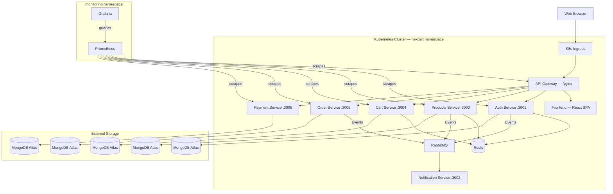
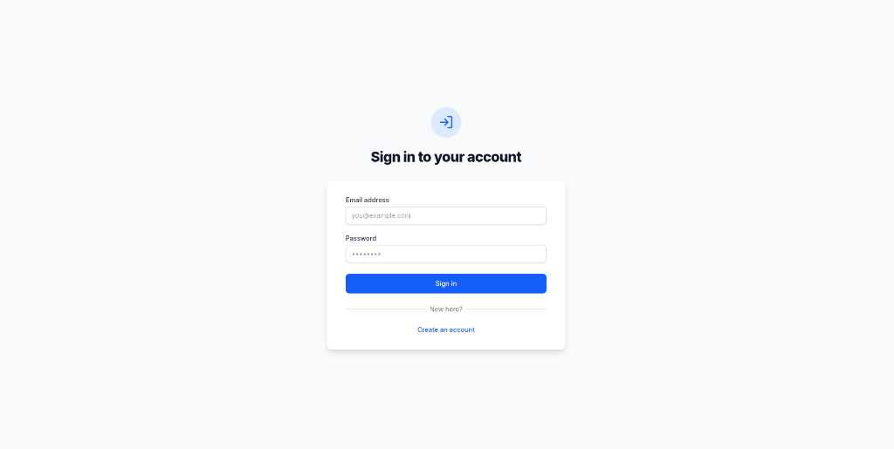
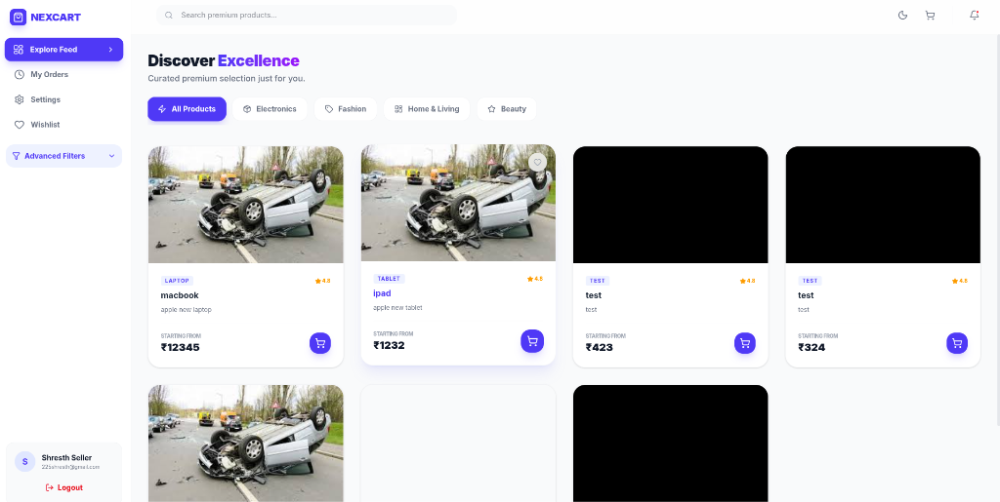
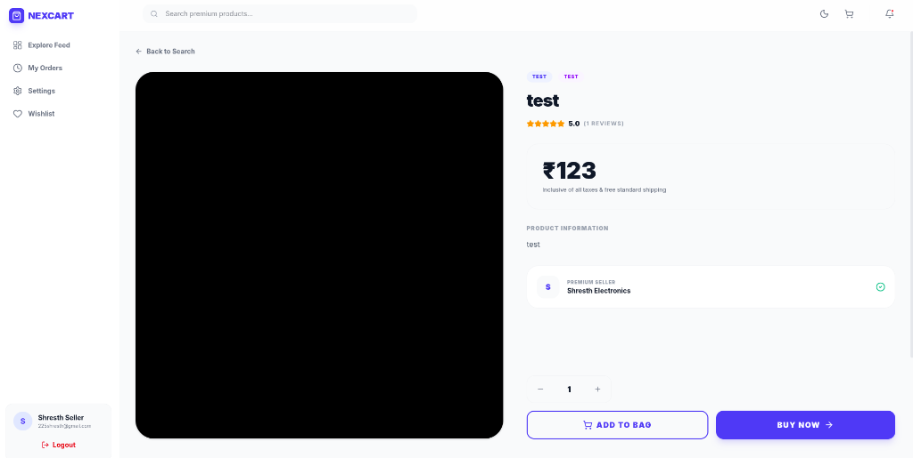
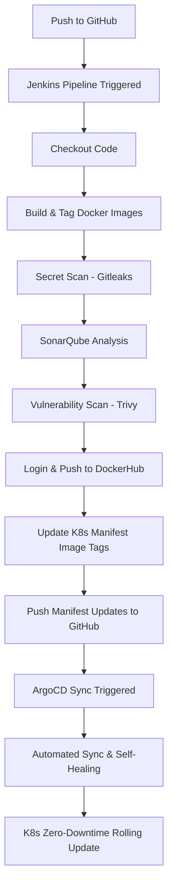
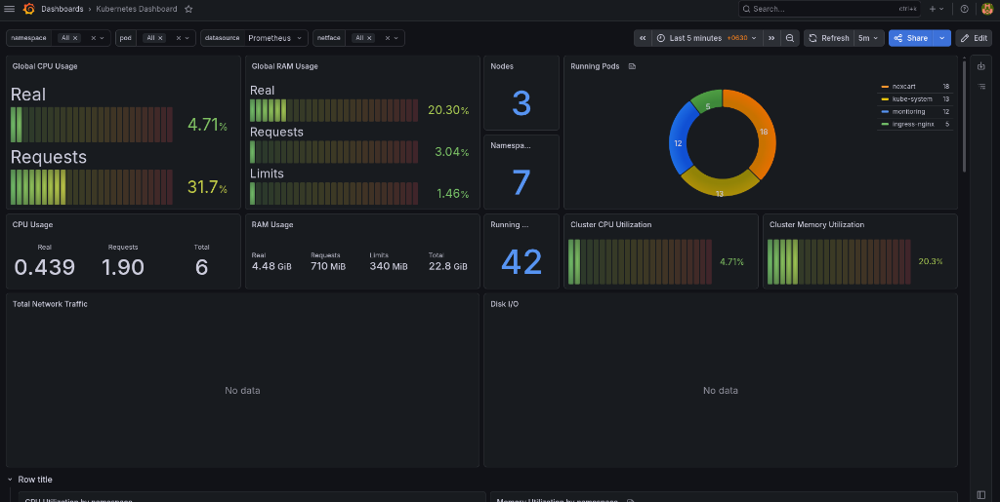

# 🛒 NexCart — Microservices E-Commerce Platform

NexCart is a production-grade, scalable e-commerce platform built on a microservices architecture. It features a premium React frontend, an event-driven Node.js backend, and a fully automated CI/CD pipeline deploying to Kubernetes on AWS.

---

## 🏗️ Architecture Overview

NexCart is designed for high availability and horizontal scalability. Each service is independently deployable, owns its own database, and communicates via synchronous REST APIs or asynchronous messaging through RabbitMQ.



---

## 🖼️ UI Screenshots

<p align="center">
  
</p>
<p align="center"><em>Sign In — Clean, minimal authentication page</em></p>

<br/>

<p align="center">
  
</p>
<p align="center"><em>Product Catalog — Browse, filter, and search across categories</em></p>

<br/>

<p align="center">
  
</p>
<p align="center"><em>Product Detail — View product info, seller details, and add to cart</em></p>

---

## 📁 Project Structure

```
NexCart/
├── api-gateway/            # Nginx-based API gateway
├── auth-service/           # Authentication & user management
├── products-service/       # Product catalog & management
├── cart-service/           # Shopping cart
├── order-service/          # Order processing & history
├── payment-service/        # Payment processing
├── notification-service/   # Email/SMS notifications (RabbitMQ consumer)
├── frontend/               # React + Vite SPA
├── kubernetes/             # K8s manifests (Deployments, Services, Secrets, Ingress)
├── terraform/              # AWS infrastructure provisioning (IaC)
├── ansible/                # K8s cluster setup & configuration
├── docs/                   # Documentation assets (screenshots, diagrams)
├── docker-compose.yml      # Local development orchestration
└── Jenkinsfile             # CI/CD pipeline definition
```

---

## 🚀 Tech Stack

### Frontend
| Technology | Purpose |
|---|---|
| React 18 + Vite | Fast builds & HMR |
| Redux Toolkit | Global state management (Auth, Cart, Orders) |
| React Router | Client-side routing |
| Vanilla CSS | Modern UI — Glassmorphism, micro-animations |

### Backend
| Technology | Purpose |
|---|---|
| Node.js + Express | Microservice runtime |
| MongoDB (Atlas) | Per-service database |
| Redis | Caching (products, sessions) |
| RabbitMQ | Async event-driven messaging |
| JWT | Stateless authentication |
| Cloudinary | Image hosting (Product Service) |

### Infrastructure & DevOps
| Technology | Purpose |
|---|---|
| Terraform | AWS EC2 provisioning (IaC) |
| Ansible | Automated K8s cluster bootstrap |
| Kubernetes | Production orchestration (2 replicas per service) |
| Docker | Containerization |
| Jenkins | CI/CD — Build → Push → Deploy to K8s |
| Nginx | API Gateway & frontend serving |

### Monitoring & Observability
| Technology | Purpose |
|---|---|
| Prometheus | Cluster & application metrics collection |
| Grafana | Real-time dashboards & visualization |

---

## 🧩 Microservices

| # | Service | Port | Description |
|---|---|---|---|
| 1 | **Auth Service** | 3001 | Registration, login, JWT auth, OTP via RabbitMQ |
| 2 | **Notification Service** | 3002 | Async email/SMS processing (RabbitMQ consumer) |
| 3 | **Products Service** | 3003 | Product CRUD, search, filtering, Cloudinary images |
| 4 | **Cart Service** | 3004 | Shopping cart with Redis-backed sync |
| 5 | **Order Service** | 3005 | Checkout flow, order history & status tracking |
| 6 | **Payment Service** | 3006 | Secure transaction processing |
| 7 | **API Gateway** | 80 | Nginx reverse proxy, routing, rate limiting |
| 8 | **Frontend** | 80 | React SPA served via Nginx |

---

## 🛠️ Getting Started

### Prerequisites
- Docker & Docker Compose
- Node.js 20+
- kubectl (for K8s deployment)

### Local Development
```bash
# Start the full stack locally
docker compose up --build
```

### Infrastructure Provisioning (AWS)
```bash
cd terraform
terraform init
terraform apply
```

### Kubernetes Cluster Setup
```bash
cd ansible
ansible-playbook site.yml -i inventory.ini
```

### Kubernetes Deployment

You can deploy the platform to your Kubernetes cluster using either a manual approach or the recommended GitOps approach.

#### Option A: GitOps Deployment (Recommended)
This approach leverages **ArgoCD** to automatically synchronize manifests in the `kubernetes` directory to the cluster.

1. **Install ArgoCD on the Cluster:**
   ```bash
   # Create the namespace for ArgoCD
   kubectl create namespace argocd

   # Install ArgoCD services
   kubectl apply -n argocd -f https://raw.githubusercontent.com/argoproj/argo-cd/stable/manifests/install.yaml
   ```

2. **Apply the NexCart Application Manifest:**
   ```bash
   kubectl apply -f argocd/application.yml
   ```
   *ArgoCD will automatically create the namespaces, configure resources, and perform zero-downtime rolling updates whenever manifests are updated.*

#### Option B: Manual Deployment
1. **Create the Namespace:**
   ```bash
   kubectl apply -f kubernetes/namespaces/namespace.yml
   ```

2. **Deploy all Services:**
   ```bash
   kubectl apply -f kubernetes/ -R
   ```

---

## ⚙️ CI/CD & GitOps Pipeline

The automated CI/CD pipeline is designed around a modern **GitOps delivery pattern**. The Jenkins pipeline (`Jenkinsfile`) automates checking out, building, and running security tests (DevSecOps). Instead of deploying directly to the cluster, Jenkins updates the Kubernetes manifest configurations in the repository. ArgoCD then detects these changes and synchronizes the cluster state.



### Pipeline Stages & Tools

| Stage | Description & Security Check |
|---|---|
| **Checkout Code** | Pulls the latest project repository from GitHub. |
| **Build & Tag** | Builds highly optimized Docker images for all 8 microservices, tagged with both `latest` and `BUILD_NUMBER`. |
| **Secret Scan (Gitleaks)** | Analyzes the repository for exposed credentials, high-entropy strings, and keys, failing the build if any are found. |
| **SonarQube Analysis** | Assesses code quality, maintainability, and coverage, enforcing code standards. |
| **Vulnerability Scan (Trivy)** | Scans service Docker images for known CVEs and OS-level vulnerabilities, enforcing a strict zero-critical-CVE policy. |
| **Push Images** | Pushes fully verified and scanned Docker images to DockerHub under `shresth2725/*`. |
| **Update Manifests** | Modifies the deployment YAML files inside `kubernetes/` to update the image tags with the new `BUILD_NUMBER`. |
| **Push Manifests** | Commits and pushes the modified manifest files back to the repository's `main` branch. |
| **ArgoCD Sync** | ArgoCD detects the change on GitHub, applies the differences, and synchronizes the cluster. |

---

## 🐙 GitOps & Continuous Delivery (ArgoCD)

NexCart uses **ArgoCD** for declarative GitOps continuous delivery. The configuration in `argocd/application.yml` points to the `kubernetes` directory of this repository and automatically synchronizes cluster deployments to match.

### GitOps Core Features

- **Automated Synchronization** (`syncPolicy.automated`) — Syncs changes in the repository to the live cluster automatically.
- **Automated Pruning** (`prune: true`) — Cleans up resources from the cluster that are deleted from the repository.
- **Self-Healing** (`selfHeal: true`) — Restores cluster state if manual changes are made in the cluster, preventing drift.
- **Namespace Creation** (`CreateNamespace=true`) — Ensures all required namespaces exist on the target cluster.

```yaml
apiVersion: argoproj.io/v1alpha1
kind: Application
metadata:
  name: ecommerce-app
  namespace: argocd
spec:
  project: default
  source:
    repoURL: https://github.com/Shresth2725/NexCart.git
    targetRevision: HEAD
    path: kubernetes
    directory:
      recurse: true
  destination:
    server: https://kubernetes.default.svc
    namespace: default
  syncPolicy:
    automated:
      prune: true
      selfHeal: true
    syncOptions:
      - CreateNamespace=true
```

---

## 🔐 Security

- **JWT Authentication** — Stateless, gateway-level token verification.
- **Secrets Management** — K8s Secrets for environment variables; `.env` files excluded via `.gitignore`.
- **Credential Isolation** — Jenkins manages DockerHub and Kubeconfig credentials securely.
- **Network Isolation** — Services communicate internally within the K8s cluster; only the Ingress/Gateway is externally exposed.

---

## 📈 Performance

- **Redis Caching** — Reduces MongoDB load for frequent reads (products, sessions, cart).
- **Async Messaging** — RabbitMQ decouples heavy operations (notifications, events).
- **Optimized Frontend** — Vite code-splitting, lazy loading, and Nginx static serving.
- **Horizontal Scaling** — Stateless services scale independently via K8s replica sets.

---

## 📊 Monitoring & Observability

NexCart uses **Prometheus** and **Grafana** for full-stack monitoring of the Kubernetes cluster and application services.

### Stack

| Component | Role |
|---|---|
| **Prometheus** | Scrapes and stores time-series metrics from K8s nodes, pods, and services |
| **Grafana** | Visualizes metrics via pre-configured dashboards with real-time alerts |
| **kube-state-metrics** | Exposes cluster-level resource metrics (pods, deployments, replicas) |
| **node-exporter** | Exposes host-level metrics (CPU, memory, disk, network) |

### Kubernetes Dashboard

<p align="center">
  
</p>

The Grafana dashboard provides real-time visibility into:

- **Cluster Resources** — Global CPU & RAM usage (real, requests, limits)
- **Node Health** — Node count, namespace distribution, running pod counts
- **Pod Distribution** — Visual breakdown of pods across namespaces (`nexcart`, `kube-system`, `monitoring`, `ingress-nginx`)
- **Utilization Metrics** — Per-namespace CPU and memory utilization percentages
- **Network & Disk I/O** — Traffic and disk metrics across the cluster

### Deployment

Prometheus and Grafana are deployed in the `monitoring` namespace via Helm:

```bash
# Add the Prometheus community Helm chart
helm repo add prometheus-community https://prometheus-community.github.io/helm-charts
helm repo update

# Install the kube-prometheus-stack (Prometheus + Grafana + Alertmanager)
helm install prometheus prometheus-community/kube-prometheus-stack \
  --namespace monitoring --create-namespace
```

### Accessing the Dashboards

Both Grafana and Prometheus are exposed via **NodePort** services in the `monitoring` namespace:

```bash
# Check the assigned NodePorts
kubectl get svc -n monitoring
```

| Service | NodePort | URL |
|---|---|---|
| **Grafana** | `<NodePort>` | `http://<Node-IP>:<NodePort>` |
| **Prometheus** | `<NodePort>` | `http://<Node-IP>:<NodePort>` |

**Grafana Credentials:**
- **Username:** `admin`
- **Password:** Retrieve from the K8s secret:
  ```bash
  kubectl get secret monitoring-grafana -n monitoring \
    -o jsonpath="{.data.admin-password}" | base64 --decode
  ```

Navigate to **Dashboards → Kubernetes** in Grafana to view cluster metrics.

---

## 🔮 Roadmap

- [x] Microservices architecture with event-driven messaging
- [x] Containerized with Docker & Docker Compose
- [x] Kubernetes manifests (Deployments, Services, Secrets, Ingress)
- [x] Terraform IaC for AWS infrastructure
- [x] Ansible automation for K8s cluster setup
- [x] Jenkins CI/CD pipeline with K8s deployment
- [x] ArgoCD — GitOps-based continuous delivery
- [x] Monitoring — Prometheus + Grafana dashboards
- [ ] Logging — ELK stack (Elasticsearch, Logstash, Kibana)
- [ ] Service Mesh — Istio/Linkerd for traffic management & observability

---

Developed with ❤️ by [Shresth](https://github.com/Shresth2725)
