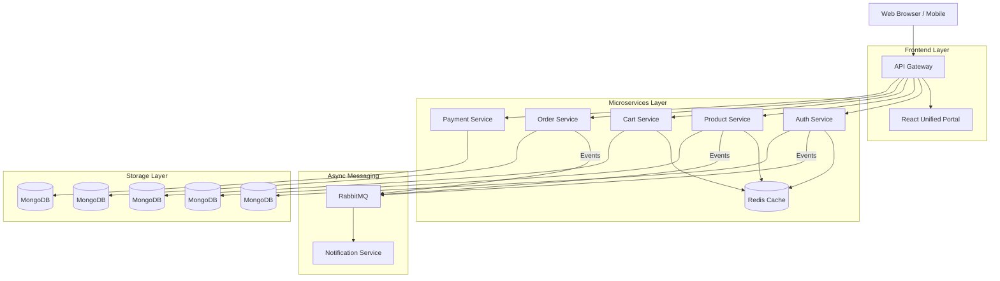

# 🛒 NexCart: High-Performance Ecommerce Microservices

NexCart is a state-of-the-art, scalable e-commerce platform built with a microservices architecture. It features a unified frontend portal with high-end aesthetics and a robust, event-driven backend ecosystem.

---

## 🏗️ Architecture Overview

NexCart is designed for high availability and horizontal scalability. Each service is independent, own its database, and communicates via synchronous REST APIs or asynchronous messaging.



---

## 🚀 Tech Stack

### Frontend
- **React 18** with **Vite** for blazing fast builds.
- **Redux Toolkit** for sophisticated state management (Auth, Cart, Orders).
- **Vanilla CSS** with modern UI patterns (Glassmorphism, Micro-animations).
- **React Router** for seamless SPA navigation.

### Backend
- **Node.js & Express**: Core framework for all microservices.
- **MongoDB**: Distributed database layer with one DB per service.
- **Redis**: High-speed caching for products, sessions, and performance optimization.
- **RabbitMQ**: Message broker for asynchronous event-driven communication (e.g., OTPs, Order updates).
- **JWT**: Secure stateless authentication.

### Infrastructure & DevOps
- **Terraform**: Infrastructure as Code (IaC) to provision AWS EC2 clusters.
- **Ansible**: Automated configuration management for Kubernetes cluster setup.
- **Kubernetes (K8s)**: Orchestration for production-grade reliability.
- **Docker & Docker Compose**: Containerization for local development and CI/CD.
- **Jenkins**: Automated CI/CD pipeline (Build -> Test -> Push -> Deploy).

---

## 🧩 Microservices Deep-Dive

### 1. Auth Service
- Secure user registration, login, and profile management.
- JWT-based authentication with Redis-backed session awareness.
- Triggers OTP verification via Notification Service.

### 2. Product Service
- Comprehensive product management (CRUD) for Sellers.
- Advanced filtering, searching, and sorting for Customers.
- Image management via Cloudinary integration.

### 3. Cart Service
- High-performance shopping cart management.
- Real-time synchronization across devices using Redis caching.

### 4. Order Service
- Complex checkout flow handling.
- Order history tracking and status management (Pending, Shipped, Delivered).

### 5. Payment Service
- Secure transaction processing.
- Integrated with external payment gateways.

### 6. Notification Service
- Asynchronous processing of emails and SMS.
- Consumer for RabbitMQ events from all other services.

### 7. API Gateway
- Central entry point for all client requests.
- Handles routing, global middleware, and request rate limiting.

---

## 🛠️ Infrastructure & Deployment

### Local Development
Run the entire ecosystem locally using Docker Compose:
```bash
docker compose up --build
```

### Infrastructure Provisioning (AWS)
Provision the server cluster using Terraform:
```bash
cd terraform
terraform init
terraform apply
```

### Cluster Setup
Configure the Kubernetes cluster using Ansible:
```bash
cd ansible
ansible-playbook site.yml -i inventory.ini
```

### CI/CD Pipeline
The project includes a `Jenkinsfile` that automates:
1. **Code Checkout**: Fetches the latest code from SCM.
2. **Build & Tag**: Creates Docker images for all services.
3. **Registry Push**: Pushes versioned images to DockerHub.
4. **Automated Deployment**: Deploys the latest stable build using Docker Compose/K8s.

---

## 🔐 Security
- **Data Protection**: Sensitive information is never stored in plain text.
- **API Security**: Gateway-level JWT verification ensures only authorized requests reach internal services.
- **Environment Management**: Secure handling of secrets via `.env` files and CI/CD credentials.

---

## 📈 Performance Optimization
- **Redis Caching**: Drastically reduces DB load for frequent read operations.
- **Optimized Frontend**: Lazy loading of components and efficient asset management via Vite.
- **Stateless Architecture**: Ensures the platform can scale horizontally without session affinity issues.

---

## 🔮 Future Updates & Roadmap
- [ ] **Full Kubernetes Deployment**: Transition from Docker Compose to native K8s manifests (Deployments, Services, Ingress).
- [ ] **ArgoCD Integration**: Implement GitOps for automated, declarative continuous delivery to Kubernetes.
- [ ] **Service Mesh**: Explore Istio or Linkerd for advanced traffic management and observability.
- [ ] **Monitoring & Logging**: Integrate Prometheus, Grafana, and ELK stack.

---
Developed with ❤️ by [Shresth](https://github.com/shresth2725)

